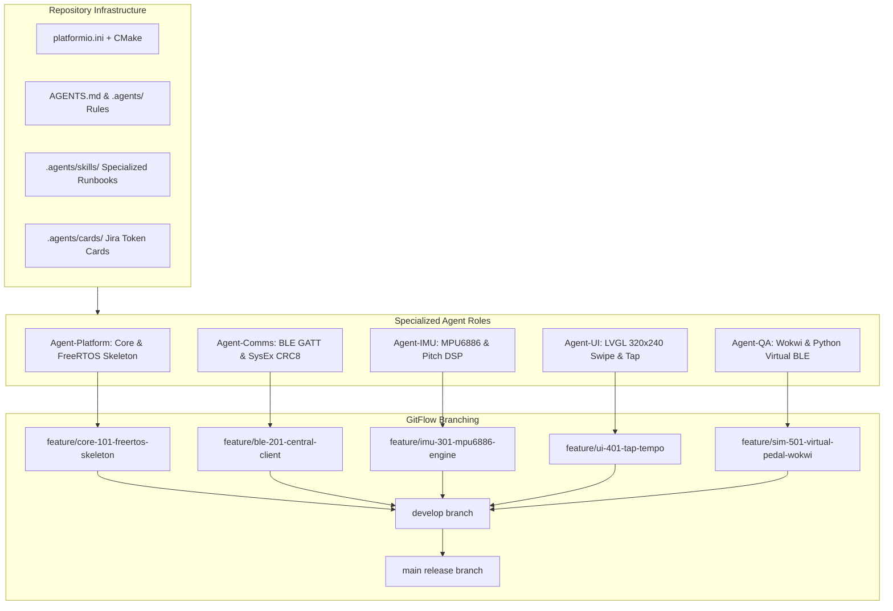
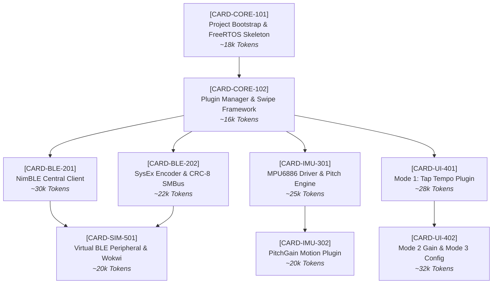

# PocketMagic Multi-Agent Architecture & Dependency Charts

## 1. Multi-Agent Development Workflow Architecture

---

## 2. Card Execution Order & Dependency Graph

---

## 3. Epic, Role & Token Metric Matrix

| Card ID | Epic | Title | Assigned Role | Primary Skill | Token Budget | Dependencies | Status |
| :--- | :--- | :--- | :--- | :--- | :--- | :--- | :--- |
| **`CARD-CORE-101`** | Epic 1: Platform | Bootstrap & FreeRTOS Dual-Core Task Skeleton | `Agent-Platform` | `platform-core` | ~18,000 | None | **Ready** |
| **`CARD-CORE-102`** | Epic 1: Platform | Plugin Manager & Swipe Gesture Navigation | `Agent-Platform` | `platform-core` | ~16,000 | `CARD-CORE-101` | Pending |
| **`CARD-BLE-201`** | Epic 2: Comms | Sonicake BLE Central Client Plugin | `Agent-Comms` | `comms-sysex` | ~30,000 | `CARD-CORE-102` | Pending |
| **`CARD-BLE-202`** | Epic 2: Comms | SysEx Packet Encoder & CRC-8 SMBus PEC | `Agent-Comms` | `comms-sysex` | ~22,000 | `CARD-CORE-102` | Pending |
| **`CARD-IMU-301`** | Epic 3: IMU | MPU6886 Driver & Pitch Motion Engine | `Agent-IMU` | `imu-dsp` | ~25,000 | `CARD-CORE-102` | Pending |
| **`CARD-IMU-302`** | Epic 3: IMU | PitchGain Motion Plugin (POC Mode 2) | `Agent-IMU` | `imu-dsp` | ~20,000 | `CARD-IMU-301` | Pending |
| **`CARD-UI-401`** | Epic 4: UI | POC Mode 1: Tap Tempo Touch Screen Plugin | `Agent-UI` | `lvgl-ui` | ~28,000 | `CARD-CORE-102` | Pending |
| **`CARD-UI-402`** | Epic 4: UI | Mode 2 Motion Gain & Mode 3 Config Screens | `Agent-UI` | `lvgl-ui` | ~32,000 | `CARD-UI-401` | Pending |
| **`CARD-SIM-501`** | Epic 5: QA/Sim | Wokwi Simulator & Python Virtual BLE Peripheral | `Agent-QA` | `qa-simulator` | ~20,000 | `CARD-BLE-201`, `CARD-BLE-202` | Pending |

### Summary Metrics
- **Total Cards:** 9
- **Total Workload:** ~211,000 Tokens
- **Target Hardware:** M5Stack Core2 v1.1 (ESP32-D0WDQ6-V3 / S3, MPU6886, AXP2101, ILI9342C TFT)
- **Target Peripheral:** Sonicake Pocket Master (`Sonic Master BLE`)
